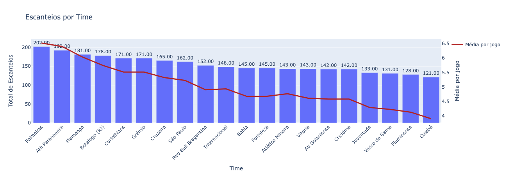
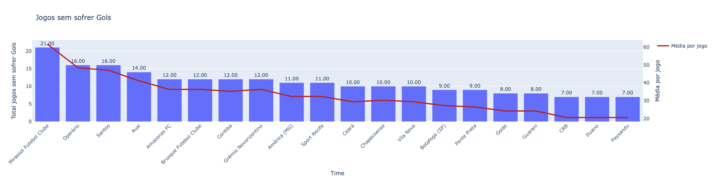

## 🐍 Web Scraping com Python

O código demonstra como fazer web scraping de conteúdo dinâmico gerado por JavaScript utilizando Python e Selenium.

Após a extração informações é gerado um arquivo JSON.

### ⚙️ Pré-requisitos
O que você precisa para instalar o software e como instalá-los:

- ```Python 3.x```
- ```Google Chrome```


### ⚙️ Executando o código
Basta acessar os arquivo ```.ipynb``` e executar os scripts na sequência.

### 🧬 Resultado
- Visão de escanteios por time
  

- Visão de jogos sem sofrer gols por time
  